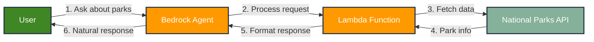

# AWS Bedrock Agent National Parks Service Example

This repository showcases how to use Amazon Bedrock to create AI agents that perform tasks on behalf of users. The agent enables users to ask natural language questions about national parks, processes these queries, and retrieves relevant information (when available) to provide accurate answers. See the related blog post [Building an AI Agent with AWS Bedrock for U.S. National Parks](https://chrisebert.net/building-an-ai-agent-with-aws-bedrock-for-u-s-national-parks-2/) for this project.

This project utilizes Amazon Bedrock, Bedrock Action Groups, Amazon CDK, and AWS Lambda while integrating with the U.S. National Parks Service API to deliver a realistic example. The AI agent demonstrates a simple task: making a single API call using Amazon Bedrock Actions. It does not employ advanced AI patterns such as routing, chaining, or parallelization.

AWS Bedrock support model support varies across regions. This project was tested deploying to the `us-east-1` region, which currently has the most robust Bedrock Foundation Model (FM) support. See [Model support by AWS Region in Amazon Bedrock](https://docs.aws.amazon.com/bedrock/latest/userguide/models-regions.html).

If you plan to deploy this project yourself, I assume you have some basic knowledge of AWS Bedrock, AWS CDK, and AWS Lambda. If you don't have experience with these topics reading the additional resources included later on this page would be helpful.

## Overview

This project showcases:

- An AWS Bedrock Agent integration with an external API, such as the U.S. National Parks Service API
- Using AWS CDK infrastructure as code (IaC) to deploy a Bedrock agent using the (currently) experimental [AWS Generative AI Constructs Library](https://github.com/awslabs/generative-ai-cdk-constructs)
- TypeScript Lambda function development

## Features

The Bedrock Agent can:

- Search for parks by state
- Get detailed information about specific parks
- Provide visitor information like operating hours and entrance fees

### National Parks Service API

This project uses the [National Parks Service API](https://www.nps.gov/subjects/developer/api-documentation.htm). Key endpoints used:

- `/parks` - Get the list of parks
- `/parks/{parkCode}` - Get specific park details

Please review the [NPS API Terms of Service](https://www.nps.gov/subjects/developer/terms-of-service.htm). You must request a free NPS API key to use this project in your AWS account.

## Project Structure

```plaintext
├── bin/ # CDK entry point
│ ├── national-parks-bedrock-agent-example
├── lib/ # CDK IaC
| ├── schema # Contains an Open API 3.0.1 spec we share with the Action Group
│ ├── stacks/ # CDK stacks
│  ├── bedrock-agent-stack.ts # Deploys a Bedrock Agent, Action Group, and sets up IAM
│  ├── national-parks-api-stack.ts # Deploys Lambda that interacts with NPS API
├── src/
│ ├── clients/ # API clients
│ │ └── nps/ # National Parks Service API client directory
│ └── functions/ # Lambda functions
│ │ └── parks/ # Parks info Lambda
└── test/ # Tests (currently not used)
```

## Using the Bedrock Agent

Once deployed, you can interact with your National Parks Agent through:

1. **AWS Console**

   - Navigate to Amazon Bedrock in your AWS Console
   - Select "Agents" from the left sidebar
   - Find your agent named "national-parks-info-agent"
   - Click "Test" to open the playground
   - Type your questions in natural language
     Example test query:

2. **AWS SDK**
   - Use the `BedrockAgentRuntime` client
   - Call the `invoke` operation
   - See AWS SDK documentation for language-specific examples

### Example Queries

Try asking the agent questions like:

- "What national parks are in Michigan?"
- "Tell me about Keweenaw National Historical Park?"
- "List the names of every park in Ohio"

### Understanding Agent Capabilities

The agent can:

- Search for parks in a specific state
- Provide detailed information about individual parks including:
   - Description and location
   - Entrance fees
   - Operating hours
   - Directions
   - Weather information

### System Flow

The following diagram illustrates how information flows through the system when a user interacts with the National Parks Agent:



### Costs

Remember you are charged for

1. Bedrock Model invocations
2. Lambda invocations
3. CloudWatch logs

## Deployment

This project leverages the experimental [generative-ai-cdk-constructs](https://github.com/awslabs/generative-ai-cdk-constructs) library to
easily configure and deploy AWS Bedrock and Action Groups. Several constructs in this library help make provisioning and deploying generative AI projects. Since this is an experimental library and this space is evolving, rapidly expect this library to change
frequently.

## Setup Steps

### Prerequisites

- Node.js (v22+)
- National Parks Service API key
   - ([Get one here](https://www.nps.gov/subjects/developer/get-started.htm))
- AWS Account with Bedrock access
   - _Note:_ AWS accounts don't have access to FMs by default. You must request access to the model(s) you wish to use and experiment with. The process is easy. In personal accounts, I recommend requesting access to all available FMs at once. As of January 2025, the `us-east-1` supports the most FMs. It's recommended that you run out of that region.
   - This project is currently using _ANTHROPIC_CLAUDE_SONNET_V1_0_ with on-demand pricing. You can feel free to experiment with different FMs.

### Initial Setup

The following steps only need to be performed once for initial setup.

1. Clone the repository:

   ```bash
   git clone https://github.com/cebert/examples-ai-bedrock-agent-national-parks.git
   cd examples-ai-bedrock-agent-national-parks
   ```

1. Install dependencies:

   ```bash
   npm install
   ```

1. Create a `.env` file or rename the file `.env.example` to `.env` and replace the placeholder environmental variable values with values specific to your AWS account. The `.env` file is excluded from git to prevent unintended secret disclosure:

   ```plaintext
   NPS_API_KEY=your_api_key_here
   AWS_ACCOUNT=your_aws_account_number
   AWS_REGION=us-east-1
   ```

1. Using the AWS CLI, configure and authenticate with AWS using your SSO credentials:

   ```bash
   aws configure sso
   ```

1. Follow the prompts to set up your SSO profile (e.g., `bedrock-agent`).

1. The first time you deploy this stack, you'll need to run the following bootstrap command to prepare your AWS environment for CDK use:

   ```bash
   cdk bootstrap aws://<AWS_ACCOUNT_ID>/us-east-1 --profile <SSO_PROFILE_NAME>
   ```

Replace `<AWS_ACCOUNT_ID>` with your AWS account ID and `<SSO_PROFILE_NAME>` with your SSO profile name (e.g., `bedrock-agent`).

### Building and Deploying

1. Build the Project:

   ```bash
   npm run build
   ```

1. Generate the CloudFormation template for your stack:

   ```bash
   npm run synth
   ```

1. Deploy the CDK application to AWS:

   ```bash
      npm run deploy -- --profile <SSO_PROFILE_NAME> --all
   ```

## Additional Resources

### AWS Bedrock & Agents

- [Getting Started with Amazon Bedrock](https://docs.aws.amazon.com/bedrock/latest/userguide/getting-started.html) - Official guide for getting started with AWS Bedrock
- [Defining Bedrock Agent Action Groups](https://docs.aws.amazon.com/bedrock/latest/userguide/agents-action-create.html) - Learn how to define agent actions and their behaviors
- [Building Effective AI Agents](https://www.anthropic.com/research/building-effective-agents) - Anthropic's guide to AI Agent design patterns and best practices

### Development Tools & SDKs

- [AWS CDK Documentation](https://docs.aws.amazon.com/cdk/latest/guide/home.html) - Complete guide to AWS Cloud Development Kit
- [AWS Generative AI Constructs Library](https://github.com/awslabs/generative-ai-cdk-constructs) - CDK constructs for working with AWS AI services
- [Telecom Bedrock Agent Example](https://github.com/aws-samples/bedrock-agent-and-telecom-apis) - Reference implementation using CloudFormation (not CDK)

### API Documentation

- [National Parks Service API](https://www.nps.gov/subjects/developer/api-documentation.htm) - Documentation for the NPS API used in this project
- [Bedrock API Reference](https://docs.aws.amazon.com/bedrock/latest/userguide/what-is-bedrock.html) - Comprehensive AWS Bedrock API documentation

### Model Information

- [Anthropic Model Comparison](https://docs.anthropic.com/en/docs/about-claude/models) - Details about different Claude models and their capabilities

### TODOs

This repository has a [TODO list](https://github.com/cebert/examples-ai-bedrock-agent-national-parks/blob/main/TODO.md) that list potential future project enhancements

## License

This project is licensed under the MIT License - see the [LICENSE](LICENSE) file for details.

## Contributing

Feel free to fork this repository or use any of the code. I don't plan to actively maintain this example as an Open Source project.
